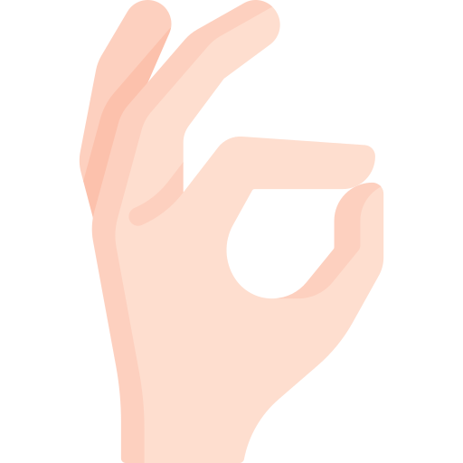
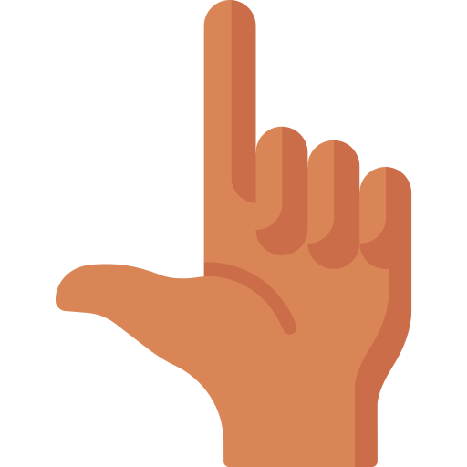

## Hand Gestures Detection using OpenCV and MediaPipe

This project is a implementation of hand gestures detection using OpenCV and MediaPipe. The hand gestures are detected using the MediaPipe Hands model. The hand gestures are then classified using a random forest classifier. 

The ready to use model is available in `model.p` file and it is trained on the following hand gestures:

| Hand Gesture                   | Description             |
|--------------------------------|-------------------------|
|  | Nice  |
|  | Peace |
|  | Loser |
|   | Swag  |

OR,   

You can train your own model by creating a new dataset.

### Getting Started

##### 1.  Clone the repository
```
git clone https://github.com/Irash-Perera/Computer-Vision-Projects.git
```
##### 2. Install the required libraries
Open the terminal in the project directory and run the following command.
```
pip install -r requirements.txt
```
##### 3. Collect images for the dataset
If you want to train your own model, you can collect images for the dataset. You can use the `collect_images.py` script to collect images. Run the python script and follow the instructions. Make sure to collect images for each hand gesture.

After collecting the images, you can create the dataset by running the `create_dataset.py` script. The dataset will be saved in the `data.pkl` file.

##### 4. Train the model
You can train the model using the `train_model.py` script. The trained model will be saved in the `model.p` file. Accuracy of the model will be printed in the terminal.

##### 5. Test the model
You can test the model using the `test_model.py` script. The script will open the webcam and detect the hand gestures.

If you are using your own model, make sure to change `labels_dict.py` according to your hand gestures. 

### Screenshots

Scrreenshots from the already trained model.

| Nice | Peace | Loser | Swag |
|------|-------|-------|------|
|  |  |  |  |

Note: When initializing camera, make sure to change the camera index according to your camera in `test_model.py` and `collect_images.py` scripts. 
```
cap = cv2.VideoCapture(<Camera_Index>)
```


